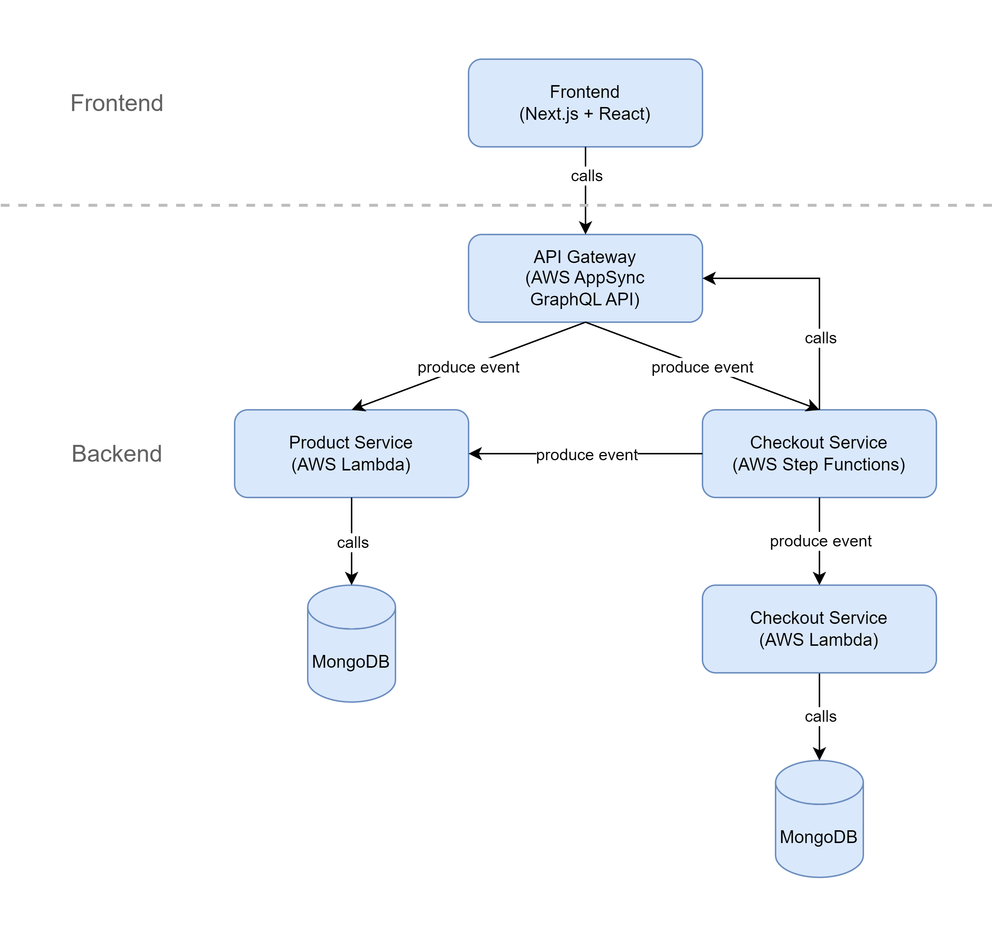

# Castleadmin Monorepo

The castleadmin [monorepo](https://nx.dev/more-concepts/why-monorepos) is the future home of all my hobby projects.
Currently, the applications needed for the website [Adventials](https://www.adventials.com)
are developed here. The GitHub repository you're visiting is a copy of the original one.
In this repository endpoint configurations and account names have been replaced with placeholders.

## Adventials Architecture

The [Adventials](https://www.adventials.com) website uses Next.js and React as frontend solutions.
The frontend requests data and start business processes in the backend via a GraphlQL API
provided with the help of the AWS AppSync service.
The backend services loosely resemble Microservices that have been build with
serverless technology.

### Microservices vs Serverless

#### Similarities

Microservices and a set of serverless functions can both provide the functionalities of a business domain.
To cut microservices by taking the business domains into account is a widely accepted approach to provide
a set of independent microservices with strong cohesion.
It also helps to avoid the distributed monolith anti-pattern.
For the same reasons, the serverless functions in this monorepo have been cut by the business domain.

#### Differences

Each Microservice provides an API that can be used by other services.
AWS Lambda serverless functions can also be designed with this approach in mind.
However, if you follow this approach with AWS Lambda you will
miss a lot of the benefits that AWS Lambda provides.
AWS Lambda natively integrates with a large number of AWS services
via events. Therefore, it is beneficial to create a set of Lambda functions
where each function reacts to one or more events.
Connecting AWS Lambda functions by using their native capabilities
leads to an event-driven architecture.

## Structure

The monorepo has been created with the help of nx.
[nx has a predefined folder structure](https://nx.dev/more-concepts/folder-structure)
that can be customized if needed.

### /apps

The /apps directory is used for executables. The following executables exist in the castleadmin monorepo.

- [/apps/adventials](apps/adventials/README.md)
  - Frontend application build with Next.js and React.
- /apps/adventials-e2e
  - E2E-Tests for the Adventials application are [coming up next](#user-content-coming-up-next).
- /apps/adventials-infrastructure
  - Provides the cloud infrastructure foundation of the Adventials backend.
  - The Adventials backend service infrastructure is build upon this foundation.
- [/apps/checkout-service](apps/checkout-service/README.md)
  - Adventials backend service that provides the functionality of the checkout process.
- /apps/checkout-service-db-init
  - Initializes the orders collection of the MongoDB database.
- [/apps/product-service](apps/product-service/README.md)
  - Adventials backend service that provides all data related to products.
- /apps/product-service-db-init
  - Initializes the products collection of the MongoDB database and fill it with automatically generated data.

### /libs

The /libs directory is used for libraries. The following libraries exist in the castleadmin monorepo.

- /libs/checkout-domain
  - Adventials checkout process business domain
- /libs/frontend-utils
  - Utility library of frontend applications
- /libs/product-domain
  - Adventials products business domain
- /libs/serverless-utils
  - Utility library of AWS Lambda functions

## Technological Overview

A variety of libraries, services and tools are used to provide and operate the Adventials website.

### Monorepo and Build Tools

- [nx](https://nx.dev/)
- [git](https://git-scm.com/)
- [Webpack](https://webpack.js.org/)
- [Serverless Webpack](https://github.com/serverless-heaven/serverless-webpack)

### Infrastructure as Code (IaC)

- [Terraform](https://www.terraform.io/)
- [Terraform Cloud](https://developer.hashicorp.com/terraform/tutorials/cloud-get-started/cloud-sign-up)
- [Serverless Framework](https://www.serverless.com/)

### Development

- [TypeScript](https://www.typescriptlang.org/)
- [Bash](https://www.gnu.org/software/bash/)
- [Node.js](https://nodejs.org/en/)
- [Next.js](https://nextjs.org/)
- [React](https://reactjs.org/)
- [Redux Toolkit](https://redux-toolkit.js.org/)
- [MUI](https://mui.com/)
- [next-i18next](https://github.com/i18next/next-i18next)
- [ajv](https://ajv.js.org/)
- [MongoDB Node Driver](https://www.mongodb.com/docs/drivers/node/current/)

### Testing

- [Jest](https://jestjs.io/)
- [Cypress](https://www.cypress.io/)

### Cross Browser Testing

- [LambdaTest](https://www.lambdatest.com/)

### API

- [AWS AppSync](https://aws.amazon.com/de/appsync/)
- [Apollo Client](https://www.apollographql.com/docs/react/)
- [AWS Certificate Manager](https://aws.amazon.com/de/certificate-manager/)
- [AWS Route 53](https://aws.amazon.com/de/route53/)

### Serverless

- [AWS Lambda](https://aws.amazon.com/de/lambda/)
- [AWS Step Functions](https://aws.amazon.com/de/step-functions/)

### CI/CD

- [GitHub Actions](https://github.com/features/actions)
- [Vercel](https://vercel.com/)
- [Serverless Framework](https://www.serverless.com/)

### Logging, Monitoring and Distributed Tracing

- [Sentry](https://sentry.io/welcome/)
- [Serverless Framework](https://www.serverless.com/)
- [Vercel](https://vercel.com/)
- [AWS CloudWatch](https://aws.amazon.com/de/cloudwatch/)
- [AWS X-Ray](https://aws.amazon.com/de/xray/)

### Database and Full-Text Search

- [MongoDB](https://www.mongodb.com/)
- [MongoDB Atlas Search](https://www.mongodb.com/cloud/atlas/lp/search-1)

### Email

- [AWS SES](https://aws.amazon.com/de/ses/) (partly implemented, coming up next)

## Commands

List of npm commands that can be executed from the monorepo root.
Don't forget to run `npm install`, if you're using the monorepo for the first time.
Project is a term that can refer to an application or a library inside the monorepo.

### prepare

Used to install the pre-commit hooks.

### pre:commit

Used to execute the pre-commit check that runs before every commit.

### env:test

Pulls the environment variables of the test environment from the Terraform Cloud
and creates the combined GraphQL schema.

### env:production

Pulls the environment variables of the production environment from the Terraform Cloud
and creates the combined GraphQL schema.

### format:affected

Format all files of the projects that have been changed compared to the last commit.

### format:all

Format all files.

### lint:workspace

Lint nx configurations.

### lint:affected

Lint all projects that have been changed compared to the last commit.

### lint:all

Lint all projects.

### test:affected

Test all projects that have been changed compared to the last commit.
The code coverage is checked against a minimum threshold of 80%.

### test:all

Test all projects. The code coverage is checked against a minimum threshold of 80%.

### build:affected

Build all projects that have been changed compared to the last commit.
The build automatically determines and builds the dependencies of a project.

### build:all

Build all projects. The build automatically determines and builds the dependencies of a project.

## Coming up next

Adventials isn't completed yet. The following list of features will be shipped with the next releases.

- Autocomplete support for the search input field.
- Sending a confirmation email after checkout completion.
- Use OIDC to provide personal data during the checkout process.
