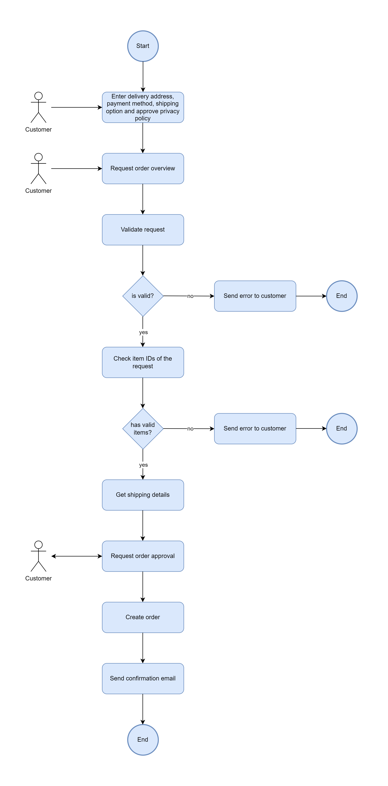

# Checkout Service

## Business Context

The customer starts the checkout process by filling out the checkout form.
Upon requesting an order overview the backend is informed. The backend validates
the checkout form data and checks the validity of the shopping cart
item IDs and their associated quantity. If everything is valid the shipping
price and the estimated delivery date is calculated. The gathered information
are sent to the customer. The customer has to approve the order, to trigger
the order creation inside the backend. If the order is created successfully
an order confirmation email is sent to the customer.

## Technical Context

The checkout service has several endpoints called handlers.
Each handler is build as a serverless function by the Serverless Framework.
The handlers are orchestrated via the checkout AWS Step Function.
The step function is defined declaratively in the checkout.asl.json.
For database interactions the MongoDB Driver is used.
Sentry is used for error reporting.
The checkout service also provides the checkout part of the GraphQL API.
This is accomplished by the definition of a GraphQL Schema and by
a set of AWS AppSync resolvers. During the checkout process,
the customer approval request is send to the frontend by triggering a GraphQL
mutation and making use of GraphQL subscriptions.
